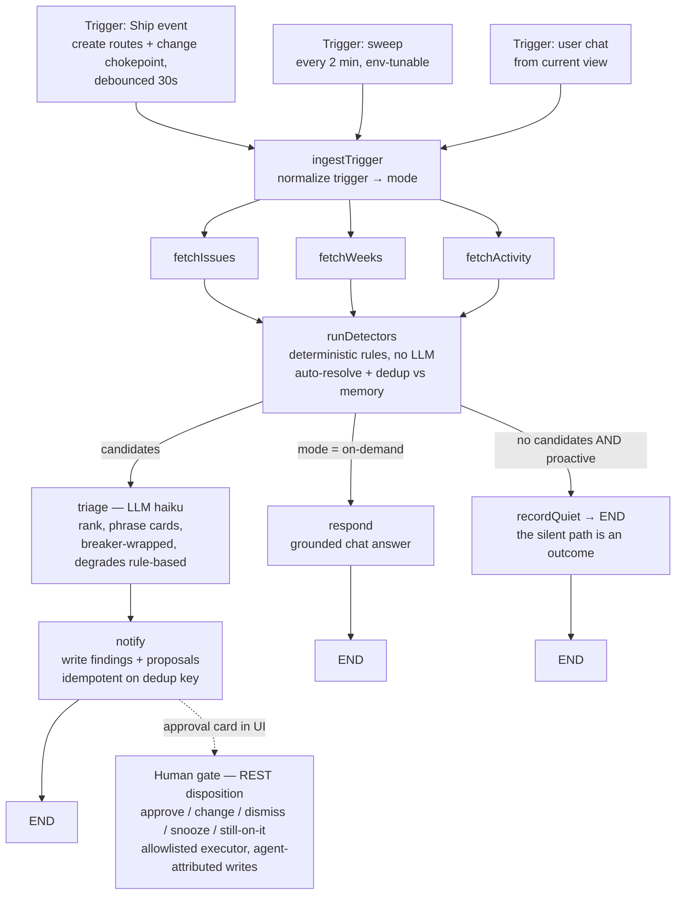

# FLEETGRAPH — Project Intelligence Agent for Ship

> **Status banner — Final (2026-08-06).**
> Updated at each checkpoint. Shipped capabilities cite files/commits;
> anything not yet wired stays labeled 🔜.

| Capability | Status |
| --- | --- |
| Ship platform (documents, issues, weeks, RACI, activity, comments, auth) | ✅ shipped — Weeks 1–4 (`api/src/`, `web/src/`) |
| Terraform-managed Render deployment | ✅ shipped — `terraform/render/` (Week 4; Week 5 changes: FleetGraph env vars, `auto_deploy=false` + CI-gated deploy, Starter tier) |
| FleetGraph graph — both modes, quiet path, breaker + degraded fallback | ✅ shipped — `api/src/fleetgraph/graph.ts` |
| Detectors: orphan intake (90 s grace + deterministic assignee proposal), stale issue; auto-resolve on cleared conditions | ✅ shipped — `api/src/fleetgraph/detectors.ts` |
| Triggers: create-route + change-chokepoint events (30 s debounce), 2-min SQL-only sweep | ✅ shipped — `api/src/routes/issues.ts`, `api/src/utils/document-crud.ts:63`, `api/src/fleetgraph/index.ts` |
| HITL: approval cards + allowlisted executor, agent-attributed writes | ✅ shipped — `api/src/routes/agent.ts`; global notification widget `web/src/components/FleetGraphNotifications.tsx` (toast + severity-scaled pulse) with cards from `AgentFindings.tsx`; verified live (approve → assign → `document_history.automated_by='fleetgraph'`) |
| Context chat panel — embedded in the document view, scoped, 401-aware | ✅ shipped — `web/src/components/AgentChatPanel.tsx` |
| LangSmith tracing with public links for distinct paths | ✅ shipped — Test Cases table |
| `/health` + `/ready` (asserts agent tables exist) | ✅ shipped — `api/src/app.ts` |
| Detectors: stuck-review / urgent-idle / week-slip (checkbox proposal) / due-soon-idle (K3) | ✅ shipped — `api/src/fleetgraph/detectors.ts`, traced in Test Cases |
| E1 credibility gate (Thompson-sampled interrupts) + K1 safe disclosure | ✅ shipped — `api/src/fleetgraph/attention.ts` (injectable RNG; critical bypass; forced probe; findings always visible — attention is gated, visibility is not) |
| CI E2E both modes on stable intent-keyed fakes + breaker-open degradation | ✅ shipped — `api/src/fleetgraph/e2e-modes.test.ts` + `test-fakes.ts` (runs in CI, zero live LLM) |
| Regression tests per use-case behavior | ✅ shipped — `api/src/fleetgraph/detectors.test.ts`, `api/src/routes/agent.test.ts` |

> 2026-08-03, post-defense: a three-lens scoping pass (economics / psychology
> / technology) amended this design before build start. Build scope is the 5
> use cases in the table below; 2 further discoveries are documented as
> deliberately deferred. Decision log: `DECISIONS.md`.

---

## Agent Responsibility

FleetGraph is Ship's project-intelligence agent. Its jurisdiction is the health
of project execution — not content authoring, not people management, not
platform administration.

### What it monitors proactively

| Signal | Source of truth | Why it matters |
| --- | --- | --- |
| Issue staleness (`in_progress` with no activity ≥ 3 days — calendar days, v1) | `documents` + activity/comments | Silent stalls are the #1 drift mode |
| Stuck reviews (`in_review` > 2 days — calendar days, v1) | issue `state` transitions | Reviews are where urgent work quietly dies |
| Urgent-but-idle (`priority = urgent` and state ∉ {in_progress, in_review, done}) | issue properties | Priority that nobody is acting on is a lie |
| Week slip risk (completion rate vs. elapsed time in the active week) | issues associated to active week | Catch slips midweek, not at retro |
| Orphaned intake (issue created with no assignee and no week) | issue create events | Unowned work never ships |
| *(deferred this week)* Accountability gaps (missing standups / plans) | `api/src/services/accountability.ts` outputs | Discovered and documented; deferred — see Use Cases §Deferred |

**Deliberately not monitored:** wiki content quality, individual performance
scoring, anything in archived/deleted documents, cross-workspace signals.

### What it reasons about on demand

The embedded chat is scoped to the view it is opened from (see "Context
protocol" below). It answers grounded questions about that document and its
neighborhood — history, related documents, who owns what, what's at risk — and
can *propose* actions, which route through the same approval gate as proactive
actions. One graph, two triggers.

### Autonomy boundary

| Tier | Actions | Rationale |
| --- | --- | --- |
| **Autonomous** | Read/analyze any project data; create findings + in-app notifications; post clearly-attributed agent comments; produce digests; answer chat | Additive, attributed, reversible-by-ignoring |
| **Human approval required** | Any mutation of user documents: change issue state/assignee/due date/priority, move issues between weeks or projects, create non-system issues; any escalation beyond the project team | Mutations rewrite someone's plan; the human owns the plan |
| **Never (hard-coded refusal, not prompt-level)** | Delete or archive documents; modify people/auth/workspace settings; any communication outside Ship (no email/Slack) | Blast radius exceeds agent jurisdiction |

The boundary is enforced deterministically: the action executor validates every
proposed action against a TypeScript allowlist before touching the database.
The model proposes; deterministic code disposes. A prompt injection that talks
the LLM into "delete everything" hits an executor that has no delete verb.

### Who it notifies, and when

Recipient resolution is deterministic, from data Ship already has:

| Condition | Notified | Source |
| --- | --- | --- |
| Issue-level finding (stale, stuck review, urgent-idle) | Assignee; project owner on repeat/severity escalation | `assignee_id`, project `owner_id` |
| Week slip risk | Project owner + accountable | `owner_id`, `accountable_id` (RACI, `document.ts:110-113`) |
| Orphaned intake | Project owner | `owner_id` |
| *(deferred)* Accountability gaps | The person who owes the artifact; accountable on repeat | accountability engine + RACI |
| *(deferred)* Daily digest | Program accountable (Director view) | program RACI |

Anti-noise policy: every finding has a dedup key (detector + document +
condition hash). A finding is *created* once; it re-arms only on snooze
expiry. Dismissed findings stay dismissed for that condition instance.
Findings **auto-resolve** when the condition clears (the issue gets an
assignee, the review lands) — the card disappears instead of going stale, so
the surface only ever shows live problems.

The notification surface (`web/src/components/FleetGraphNotifications.tsx`,
mounted globally in `App.tsx`) enforces the same economics in the UI, shaped
by three rounds of live field feedback (DECISIONS.md 2026-08-04): a new
finding **toasts once** and the bottom-right button pulses until the panel
is opened; a glance buys quiet **in proportion to severity** (critical 30 m /
high 1 h / medium 2 h / low 4 h), after which an undecided finding re-pulses;
only a disposition clears it for good; and zero findings renders **nothing**
— the agent earns screen space, it does not reserve it. The agent earning the
right to be listened to is a design goal: **the quiet path is a first-class
graph outcome.** (The grace-window + auto-resolve pair is PagerDuty's
"Auto-Pause" noise-reduction pattern ported to project tooling.)

**E1 — credibility-weighted interrupts** (`api/src/fleetgraph/attention.ts`):
per (user × finding type) the agent keeps a discounted Beta posterior on
"was this finding useful" — `α ← 0.9α + engaged; β ← 0.9β + ignored`,
updated on every disposition (`api/src/routes/agent.ts`). Before
interrupting, it samples `p̃ ~ Beta(α, β)` (Thompson sampling — exploration
built in, no death spiral) and interrupts only when
`severity ≥ θ₀ + c·(1 − p̃)`. Guards: critical always interrupts; a forced
probe fires if a user has heard nothing for 5 days; and the finding row is
**always** written — attention is gated, visibility is not. Suppressed
recipients are recorded in the finding's evidence so the card can explain
itself. No shipped competitor adapts per-user interrupt thresholds from
response behavior (research pass, DECISIONS.md 2026-08-03).

**K1 — safe disclosure (incentive compatibility):** a recent Still-on-it on
the same document demotes the next finding one severity step, drops the
owner escalation, and has triage frame the card as a proactive update
("Self-reported:") — reporting bad news early always beats hiding it.

### How it knows who is on a project and their role

Ship already encodes this — no new membership model is needed:
- RACI fields on projects and programs: `owner_id`, `accountable_id`, `consulted_ids`, `informed_ids` (`shared/src/types/document.ts:91-114`)
- `assignee_id` on issues (`document.ts:76`)
- `person` documents linked to users via `properties.user_id` (`api/src/db/schema.sql:358`)
- Workspace membership roles admin/member (`schema.sql:33-52`)

### Context protocol (on-demand mode)

The chat panel mounts inside the existing 4-panel editor layout and posts
`{ doc_type, doc_id, week_id?, project_id? }` from the current route. The
`loadContext` node expands that seed via `document_associations` into the
reasoning neighborhood: the document itself, its parent project/program, the
active week, sibling issues, recent comments/activity. A chat opened on an
issue reasons from that issue; on a week view, from that week's issue set. There
is no standalone chat page.

---

## Graph Diagram

One `StateGraph` (LangGraph.js), three entrypoints that differ only in the
trigger payload. The difference between modes is the trigger, not the graph.

**Conditional edges** (each produces a visibly different LangSmith trace —
`api/src/fleetgraph/graph.ts` (the conditional-edge block after `runDetectors`)):
1. `runDetectors` → `recordQuiet` (proactive, zero candidates — zero tokens)
2. `runDetectors` → `respond` (on-demand mode)
3. `runDetectors` → `triage` → `notify` (candidates found)

**The human gate sits at the edge of the graph, not inside it**: `notify`
writes the finding + allowlisted proposal; the human decides on the card
(`POST /api/agent/findings/:id/disposition`, `api/src/routes/agent.ts`), and
the deterministic executor applies approved mutations with agent-attributed
audit rows. An in-graph `interrupt()` + Postgres-checkpointer variant (gate
visible inside the trace, resumable across restarts) is designed and
**deliberately deferred post-submission** — the shipped REST gate is fully
functional, regression-tested, and verified live; the checkpointer version
is trace-cosmetic, not safety-functional.

**State:** distinct keys per parallel fetch node (`issues`, `weeks`,
`recentActivity`) plus `{ trigger, mode, workspaceId, projectScope,
candidates, triaged, path, chatResponse, degraded }`
(`api/src/fleetgraph/state.ts`). Between runs, only `agent_findings` rows
persist (dedup + disposition memory) — the graph itself is stateless between
runs.

---

## Use Cases

Five use cases defined — **all five built, traced, and regression-tested**
(per-row trace links in the Test Cases table; tests in
`api/src/fleetgraph/detectors.test.ts`, `api/src/routes/agent.test.ts`, and
the CI E2E suite `e2e-modes.test.ts`). The detector family also includes the
K3 due-soon-idle rule and the urgent-idle proxy inside use case #3's
behavior set.

| # | Role | Trigger | Agent detects / produces | Human decides |
| --- | --- | --- | --- | --- |
| 1 | PM | Event: issue created, then still without assignee and week after a 90 s no-edit grace window (Ship's Untitled-first model means every issue is born momentarily orphaned) | Orphan finding + proposed assignee based on current load and history, with inline assignee picker on the card; grace window stated on the card | Approve / change (inline picker) / reject |
| 2 | Engineer / PM | Sweep: `in_progress` issue, no activity ≥ 3 days (calendar, v1) | Stale-issue finding phrased about the artifact, drafted nudge to assignee; escalation to project owner is forewarned on the card, never silent | **Still on it** (one tap, resets clock, notifies nobody) / reassign / snooze |
| 3 | Engineer | Event: issue enters `in_review`, then sweep finds it there > 2 days (calendar, v1) — or `urgent` priority sitting idle | Stuck-review / urgent-idle finding, names who can unblock, drafts the ask (sent as the agent, attributed — never ghost-written) | Approve sending the nudge; approve any reassignment |
| 4 | PM | Sweep, midweek: completion rate vs. elapsed time in active week below threshold | Slip-risk forecast with evidence inline ("70% elapsed, 20% done") + scope-cut candidates as per-item checkboxes | Approve the checked subset; unchecked items recorded as dismissed |
| 5 | All roles | User opens agent chat on an issue / week / project view | Grounded answers from the view's neighborhood; header + suggested questions prove the scoping at first paint; proposed actions where relevant | Approves any proposed mutation before it executes |

**Use case 1 is the MVP anchor**: it is the one detection a grader can
provoke live (create an unassigned issue) and it lands on the event path —
proactive detection + HITL card + timed-latency proof in a single flow.
Absence-of-events detections (2–4) are proven against back-dated seed state
plus the sweep path.

### Discovered, deliberately deferred (documented discovery, not built)

- **Accountability-gap detection** (missing standups/plans; PM/Director) —
  highest integration risk (couples to the accountability engine's output
  semantics) for a detection use case 2 already demonstrates in kind.
- **Daily 9:00 Director digest** — adds a third trigger type, exercises no
  HITL gate, and is the one LLM run not gated by a deterministic detector,
  which would undermine the "quiet projects cost $0" cost defense.

Both remain designed (recipient rules above) and are the first candidates
post-submission.

---

## Trigger Model

**Decision: hybrid — in-process event triggers + a 2-minute deterministic
sweep.** ✅ shipped (`api/src/fleetgraph/events.ts`, `index.ts`).

Because FleetGraph lives inside the Ship API process (see Architecture
Decisions), "webhooks" collapse into something better: **in-process event
emission** — a handful of deliberate hook points, not a per-route retrofit of
all ~82 mutating handlers. The agent subscribes, debounces per project (30 s),
and runs the graph. No HTTP hop, no webhook auth, no delivery failure mode.
Yjs editor activity needs no hook at all for staleness purposes: the
collaboration server already bumps `documents.updated_at` on content edits
(`api/src/collaboration/index.ts:173`).

The sweep (node-cron, env-configurable interval, default 2 min) exists because
**the most important signals are the absence of events**. A stale issue emits
nothing — silence is the trigger. No event system can detect inactivity; only
a clock can. The tight default is deliberate belt-and-braces for the graded
latency window: the sweep is SQL-only, so running it often is effectively free.

Event hooks shipped at MVP: the issue create route (`POST /api/issues`,
`api/src/routes/issues.ts:646`) plus the shared change chokepoint
`logDocumentChange` (`api/src/utils/document-crud.ts:63`) — chosen against
call-site evidence, because the change logger alone never fires on creation.
Hooks on the generic `POST /api/documents` create path and wiki→issue type
conversion are **deliberately deferred**: those paths are covered by the
2-minute sweep backstop (worst-case latency still inside the 5-minute
window), so the extra hooks buy seconds, not correctness.
Creation is the MVP
anchor's trigger.

| Model | Detection latency | Cost at 100 / 1,000 projects | Failure modes |
| --- | --- | --- | --- |
| Poll only | Bounded by interval; 5-min goal forces aggressive polling of everything | SQL is cheap, but naive LLM-per-poll explodes; 1,000 projects × 288 sweeps/day is untenable if LLM is in the loop | Wasteful when quiet; misses nothing |
| Events only | Seconds | Cheapest per event | **Blind to inactivity** — the primary drift signal; misses time-based conditions entirely |
| **Hybrid (chosen)** | Seconds for event-driven; ≤ 5 min for time-based | Sweep is SQL-only; LLM invoked **only when deterministic rules fire** — quiet projects cost $0 in tokens | Two code paths to maintain — acceptable; they share the whole graph |

**Cost control is structural, not aspirational:** the LLM sits *behind* the
deterministic detector stage. A sweep over a healthy project runs SQL, finds no
candidates, records the quiet path, and ends — zero tokens. Findings are
deduped before triage, so a known-and-notified condition also costs zero.

**Latency budget for the graded timed test:** grader creates an issue → create
route emits in-process → 90 s no-edit grace window for orphan detection (see
Use Cases — Ship's Untitled-first model means every issue is born momentarily
unassigned; firing instantly would be a noise firehose) → 30 s debounce →
graph run (fetch + detect ≈ 1–2 s SQL, triage ≈ 5–15 s LLM) → card visible.
Expected ≈ 2–3 minutes for the orphan case, < 60 s for non-grace-window
events, against a 5-minute goal. Time-based conditions are bounded by the
2-minute sweep interval.

**Staleness tolerance:** event-driven detections are near-real-time; drift
detections (staleness, slip) have day-scale deadlines, so a 2-minute sweep is
orders of magnitude tighter than needed — chosen anyway because it is free
(SQL-only) and it is the backstop for the graded latency window.

---

## Test Cases

*Complete. Rows 1, 5 and Q carry production/local trace links from the MVP
timed rehearsal; rows 2–4 were filled 2026-08-06 from one seeded
multi-detector sweep (see the note below the table).*

| # | Ship state (seeded, real data — no mocks) | Expected output | Trace link |
| --- | --- | --- | --- |
| 1 | Issue created live with no assignee, no week, left untouched through the 90 s grace window (grader-provokable; this is the timed-latency test) | Orphan finding + proposed assignee + approval card, visible < 5 min. **Measured on production 2026-08-04: created 19:15:07 → card 19:20:02 = 4 m 55 s** (grace window reset while the title was typed, by design) | [prod trace](https://smith.langchain.com/public/06df5809-5e0a-431c-a00b-a6c2a2d26de6/r) · [local trace](https://smith.langchain.com/public/9e688edf-1545-4de8-8915-0b0d198e40e1/r) |
| 2 | Issue `in_progress`, `updated_at` back-dated 4 days (calendar days, v1) | Stale finding "Refactor auth session cache has had no activity…"; Still-on-it available; dedup key recorded | [sweep trace](https://smith.langchain.com/public/f2d6e21e-14f4-4e96-84e5-1a23f5267842/r) — `stale_issue` candidate |
| 3 | Issue in `in_review`, idle 3 days | Stuck-review finding "…in review, idle 2 days"; attributed ask | [same sweep trace](https://smith.langchain.com/public/f2d6e21e-14f4-4e96-84e5-1a23f5267842/r) — `stuck_review` candidate |
| 4 | Active week (computed window) 64% elapsed, 0/3 done | Slip finding, loss-framed ("all 3 issues not started with 64% of week elapsed"), high severity, per-item checkbox proposal | [same sweep trace](https://smith.langchain.com/public/f2d6e21e-14f4-4e96-84e5-1a23f5267842/r) — `week_slip` candidate |
| 5 | Chat opened on issue "Payment webhook retries fail silently": "What's the current state of this issue?" | Grounded answer citing the issue's real state/priority/assignee/timestamps; different trace shape from proactive runs | [chat trace](https://smith.langchain.com/public/810f4f6b-648b-4e47-9a77-8145a0b3ecc6/r) |
| Q | Healthy project, sweep fires | **Quiet path** — trace ends at `recordQuiet`, zero LLM calls (run logged `path=quiet`, 67 ms) | [quiet-path trace](https://smith.langchain.com/public/08dd7d9f-dcd6-486a-9c43-d0ec8fc17639/r) |

Test case Q is deliberate: the quiet path and the finding path are the two
shared trace links for MVP — proof the graph branches ("a graph that looks
identical across every run is a pipeline").

Rows 2–4 share one trace on purpose: all three states were seeded and one
sweep detected all of them in a single run — the trace's triage input shows
the `stale_issue`, `stuck_review`, and `week_slip` candidates side by side,
which demonstrates the detector family more strongly than three separate
runs would.

---

## Architecture Decisions

*Section due at Early Submission; drafted at defense time because these
decisions are what the defense is. Running log in `DECISIONS.md`.*

**Framework — LangGraph.js, in-process.** LangGraph is the assignment's
recommended path and gives LangSmith tracing without manual instrumentation.
TypeScript variant because Ship is a TypeScript monorepo: shared types
(`shared/`), direct Postgres access, no second language, no second deploy
pipeline. *Rejected:* Python LangGraph (canonical, better Studio support — but
a second runtime, REST-only Ship access, second deployment); hand-rolled
pipeline (would require manual trace instrumentation and re-implementing
interrupts/checkpointing).

**Placement — inside the Ship API service, not a sidecar.** Direct function/SQL
access to Ship data (no service-to-service auth problem — the assignment's
"how does it authenticate with Ship without a user session" dissolves: it
holds a DB pool, acting through an `agent` service identity recorded on every
write), in-process events give <60s latency for free, one Terraform-managed
service. *Rejected:* separate agent service — cleaner story, but buys real
auth/latency/deploy costs for zero graded benefit; the graph is still an
isolated module (`api/src/fleetgraph/`) extractable later.

**Trigger — hybrid.** See Trigger Model. *Rejected:* poll-only, event-only.

**State — Postgres for everything.** LangGraph Postgres checkpointer for
interrupt/resume; `agent_findings` table as inter-run memory (dedup +
disposition + notification feed); `agent_runs` for cost/latency accounting.
Boring technology; the DB already exists and is already backed up.
*Rejected:* Redis/in-memory (loses HITL interrupts on restart, new infra).

**HITL — REST disposition gate + a global notification widget.** As shipped:
`notify` writes the finding with its allowlisted proposal (idempotent on the
dedup key), the card renders in a global bottom-right widget
(`web/src/components/FleetGraphNotifications.tsx`, cards from
`AgentFindings.tsx`), and the human decides via
`POST /api/agent/findings/:id/disposition` — Approve / Change (inline
assignee picker) / Dismiss / Snooze / **Still on it** (resets the clock,
notifies nobody). Mutations execute only through the deterministic allowlist
executor with agent-attributed audit rows. *Evolution, honestly told:* the
defense-day plan was ActionItems-surface cards plus a LangGraph `interrupt()`
gate; live field feedback moved the surface to a global widget (findings must
live where people are, DECISIONS.md 2026-08-04), and the interrupt-based
in-graph gate — which makes the human decision visible inside the trace and
resumable via the Postgres checkpointer — is deliberately deferred
post-submission (see the graph section note).
The shipped gate is equally safe (same executor, same allowlist); the
interrupt variant is trace-visibility polish. Snooze re-arms the dedup key
with an expiry. *Rejected:* new bell/inbox page (the widget is lighter and
follows the user); free-text confirmation in chat (unauditable); auto-apply
with undo (mutating someone's plan and apologizing is the wrong default).

**Model routing and the injectable client seam.** Triage/detection ranking:
cheapest capable model (claude-haiku-4-5), because inputs are pre-structured
by deterministic detectors. Chat/respond: claude-sonnet-5 for grounded
reasoning quality. All LLM calls go through `ChatAnthropic`
(`@langchain/anthropic`) — not the raw SDK — so LangSmith traces carry
token/prompt spans and the cost accounting stays honest. The model client is a
constructor dependency of the graph from day one: real Anthropic in dev/demo
runs (the "real Ship data" requirement), recorded fixtures as stable fakes in
CI (the reproducible-test requirement). CI fakes are keyed by **graph node /
intent**, not by request hash — request-hash fixtures invalidate on every
prompt tweak and put the team on a re-record treadmill with live keys, which
defeats the point of stable fakes. *Rejected:* raw `@anthropic-ai/sdk`
inside a custom wrapper (LLM spans vanish from traces); retrofitting the test
seam later (the expensive version); request-hash-keyed fixtures (brittle).

**Deployment — extend `terraform/render/` (Week 4).** Same service, new env
vars (never committed — Render env vars via TF variables), `/health` exists,
`/ready` added (DB + migrations + agent-tables check). Two corrections from
the scoping pass: (1) `terraform/render/main.tf:129` currently sets
`auto_deploy = true` (deploy on push), which contradicted the CI-gated-deploy
claim — fix is `auto_deploy = false` + a Render deploy-hook step at the end of
the CI `checks` job (`.github/workflows/ci.yml`); (2) Render **Starter** tier
(always-on, ~$7/mo) is load-bearing, not an optimization — on free tier,
node-cron does not run while the service is idled, so proactive mode would not
exist during the graded window. Two more corrections from the cold-critic
pass: (3) the critic flagged a migration-runner defect cited by a KNOWN-DEFECT
note in `terraform/render/main.tf` — on verification (2026-08-03) that note is
**stale**: the defect was fixed in Week 4 (`f3c89c5`, 2026-07-29 — catch
scoped to schema.sql, per-migration transactions, rollback + exit 1; evidence
in `docs/pr-evidence/week4-cat6/`). The Day-1 step is therefore correcting the
stale terraform note, and `/ready` still asserts the agent tables exist so any
future defect of this class can never hide; (4) `terraform
destroy` takes `render_postgres` (and all data) with it, and the start command
migrates but never seeds — so the destroy-and-redeploy proof includes a
documented repopulation step (as executed 2026-08-04: the app's own
first-run setup wizard on the fresh database; `pnpm db:seed` remains the
scripted alternative), plus a tfstate backup. Destroy-and-redeploy
test re-run for Week 5 with the agent in place.

**Resilience (Engineering Requirements).** All outbound calls (Anthropic;
LangSmith is fire-and-forget async) wrapped with: 30 s timeout, 3 retries with
exponential backoff + jitter, circuit breaker (opens after 5 consecutive
failures, half-open probe at 60 s). Degraded mode when the breaker is open:
deterministic detections still surface, labeled "rule-based (unranked)"; chat
returns an honest unavailable message; nothing crashes or hangs. Ship-API-down
is not a separate failure domain (in-process); DB-down fails the whole service
and the sweep resumes idempotently on restart via dedup keys. Rollback, stated
honestly: deploys are CI-gated (no CI-green, no deploy — deploy-hook model,
see Deployment above), and rollback is a documented `git revert` + push
procedure (CHANGES.md at MVP). Render one-click rollback is unavailable below
paid tiers, so we do not claim automated live-deploy rollback — we prevent bad
deploys instead.

---

**Attention as mechanism design (E1 + K1 + K3 + B1, shipped 2026-08-06).**
Notification policy is code, not configuration: E1's Thompson-sampled
credibility gate (`attention.ts`, injectable RNG so CI tests both sides of
the threshold deterministically), K1's disclosure rule, K3's due-soon-idle
detector (present-bias/student-syndrome), and B1's loss-framed slip copy in
the triage prompt. *Rejected:* static per-org thresholds (what every
competitor ships; can't distinguish Dana from Sam); greedy posterior-mean
gating without sampling (death-spiral risk — a user who dismissed early
would never be interrupted again); gating finding *visibility* rather than
interrupts (hiding information from the panel punishes the user for the
agent's miscalibration). The checkbox card's server side enforces an
allowlist-within-the-allowlist: only issue ids present in the stored
proposal can execute, whatever the client sends.

## Engineering Requirements

All five graded engineering requirements, each with its enforcement point:

| ☑ | Requirement | Evidence |
| --- | --- | --- |
| ☑ | **Regression tests with rollback** — every use-case behaviour has a corresponding regression test; a failing CI run never stays deployed | Behaviour→test mapping: orphan+proposal+grace → `detectors.test.ts` ("orphan_intake: fires only past the 90s grace…") + `agent.test.ts` approve/change; stale+Still-on-it → `detectors.test.ts` + `agent.test.ts` still_on_it; stuck-review/urgent-idle/due-soon-idle → `detectors.test.ts`; week-slip checkbox subset → `detectors.test.ts` week_slip block + `agent.test.ts` subset/smuggling/400 tests; chat → `e2e-modes.test.ts`. Rollback: `auto_deploy=false` (`terraform/render/main.tf`) means the CI `deploy` job is the only push-driven path to production — no green `checks`+`secret-scan`, no deploy; a bad *shipped* behaviour rolls back via documented `git revert` + push (CHANGES.md), and `FLEETGRAPH_ENABLED=false` is the no-deploy kill switch |
| ☑ | **E2E tests for critical workflows, both modes, in CI** — (1) event introduced → agent surfaces it within the window; (2) context-aware chat → grounded response | `api/src/fleetgraph/e2e-modes.test.ts`, auto-run by CI's api test step (verified in CI run 31122756650 logs: `✓ src/fleetgraph/e2e-modes.test.ts (4 tests)`): proactive seed→sweep→card-served with latency assertion; on-demand chat through the real route with grounding assertions |
| ☑ | **External services mocked with stable fakes** — tests pass in CI regardless of network/API availability; the running agent still uses real Ship data | `api/src/fleetgraph/test-fakes.ts`: intent-keyed fakes (`FakeTriageModel` parses the real candidate payload and answers by dedup key — never request-hash fixtures); zero live LLM/network in any test; the deployed agent runs against the live database (no mocks) — the two requirements are satisfied simultaneously, as the assignment intends |
| ☑ | **Retries, timeouts, circuit breakers; graceful degradation** | `api/src/fleetgraph/models.ts` (30 s timeout, 3 retries w/ exponential backoff via ChatAnthropic) + `resilience.ts` (breaker: opens after 5 consecutive failures, half-open probe at 60 s). Degradation is *demonstrated durably in CI on every push*: the breaker-open E2E test proves rule-based findings still land (`rule_based_only=true`) and chat answers honestly — nothing crashes or hangs. Ship-API-down is not a separate failure domain (in-process agent); sweeps resume idempotently via dedup keys |
| ☑ | **Developer documentation** | `CHANGES.md` — Week-5 sections (MVP + Final addendum): what was built, run/test locally, deploy, roll back — written for the next engineer |

## Cost Analysis

### Development and testing costs (measured, 2026-08-04 → 2026-08-06)

Sources: LangSmith traces (per-call token counts, `fleetgraph` project) and
the local `agent_runs` accounting table. CI and the test suites use fakes —
zero live tokens by design.

| Item | Amount |
| --- | --- |
| Claude API — input tokens | **11,484** (haiku 3,851 · sonnet 7,633) |
| Claude API — output tokens | **1,608** (haiku 1,445 · sonnet 163) |
| LLM calls during development | **7** (6 triage on claude-haiku-4-5, 1 chat on claude-sonnet-5) |
| Graph invocations (local accounting table) | **130** — 122 quiet · 4 finding · 1 chat · 3 error (early column-name bug, fixed) |
| — plus production sweeps | continuous 2-min cadence since 2026-08-04, ≈720/day, ~all quiet ($0) |
| Total development LLM spend | **≈ $0.04** (haiku $0.011 + sonnet $0.025 at $1/$5 and $3/$15 per MTok) |

The 130-run/7-LLM-call ratio is the cost architecture in one line: **94% of
graph runs never touched a model.** Deterministic detectors and dedup gate
the LLM, so spend tracks problems found, not monitoring performed.

### Cost per graph run (MVP estimate, defended)

| Run type | Model | Tokens (est.) | Cost |
| --- | --- | --- | --- |
| Quiet sweep (no candidates) | none — SQL only | 0 | **$0.000** |
| Triage (finding path) | claude-haiku-4-5 ($1/M in, $5/M out) | ~4k in / ~0.75k out | **≈ $0.008** |
| Chat turn | claude-sonnet-5 ($3/M in, $15/M out) | ~6k in / ~0.75k out | **≈ $0.029** |

Grounding: the observed production finding run (2026-08-04 19:20 UTC)
consumed 670 total tokens on Haiku ≈ **$0.002** — under the estimate, which
deliberately budgets for fuller project neighborhoods than a demo workspace.

### Estimated runs per day (MVP estimate, defended)

Per active project: 720 sweeps/day (2-min interval, $0 — the LLM sits behind
the detectors and dedup, so a quiet or already-notified project never spends
a token) + an estimated 5–15 triage runs/day (bounded by *new* rule hits, not
by project count) + 1–3 chat turns per active user per day. Worst-case daily
LLM spend per active project ≈ 15 × $0.008 + 3 users × 3 × $0.029 ≈
**$0.38/day** — the cost structure scales with problems found and questions
asked, not with monitoring coverage (see §Trigger Model).

### Production cost projections

Assumptions (each defended; measured per-call sizes match the dev data
above within its ranges):
- **Proactive runs per project per day:** 8 LLM triage runs (rule hits;
  sweeps themselves are SQL-only — 720/day/project at $0)
- **On-demand invocations per user per day:** 0.5 chat turns (≈20% daily
  actives × 2–3 questions)
- **Average tokens per invocation:** triage ≈ 4k in / 0.75k out
  (claude-haiku-4-5); chat ≈ 7.5k in / 0.5k out (claude-sonnet-5 — the
  measured chat call was 7.6k in / 163 out)
- **Cost per run:** triage ≈ $0.008 · chat ≈ $0.030 · quiet sweep $0
- **Projects:** ≈ 1 per 10 users
- **Estimated runs per day (1,000 users):** 72,000 sweeps ($0) + ~800
  triage + ~500 chat

| | 100 users | 1,000 users | 10,000 users |
| --- | --- | --- | --- |
| Triage (8/project/day) | $0.64/day | $6.40/day | $64/day |
| Chat (0.5/user/day) | $1.45/day | $14.50/day | $145/day |
| **LLM total** | **≈ $63/mo** | **≈ $630/mo** | **≈ $6,300/mo** |

Structure of the number: chat dominates ~70% at every scale — the
monitoring itself is nearly free. Stated cost levers, in order of impact:
route chat to claude-haiku-4-5 (÷10 on the dominant term → ~$2.1k/mo at
10k users), prompt-cache the stable neighborhood prefix, and cap chat
neighborhoods (already designed). Cost cliffs and their mitigations:
fetch-stage over-fetching (scoped SQL, never "select the workspace") and
long chat histories (neighborhood cap + compaction).
