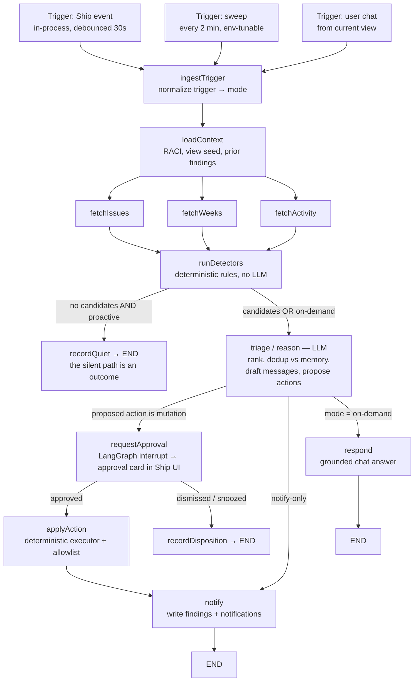

# FLEETGRAPH — Project Intelligence Agent for Ship

> **Status banner — Architecture Defense (Week 5, Day 0).**
> Everything below the shipped-vs-planned table is the *designed* architecture,
> produced for the 4-hour Architecture Defense checkpoint. No FleetGraph code has
> been written yet; claims about Ship internals cite existing code, claims about
> FleetGraph are labeled 🔜 designed. This banner is updated at each checkpoint.

| Capability | Status |
| --- | --- |
| Ship platform (documents, issues, weeks, RACI, activity, comments, auth) | ✅ shipped — Weeks 1–4 (`api/src/`, `web/src/`) |
| RACI ownership on projects/programs | ✅ shipped — `shared/src/types/document.ts:91-114` |
| Accountability engine (auto-generated action items) | ✅ shipped — `api/src/services/accountability.ts` |
| Terraform-managed Render deployment | ✅ shipped — `terraform/render/` (Week 4) |
| FleetGraph graph, detectors, triggers, HITL, chat, notifications | 🔜 designed, not yet wired (this document) |

> 2026-08-03, post-defense: a three-lens scoping pass (economics / psychology
> / technology) amended this design before build start. Build scope is the 5
> use cases in the table below; 2 further discoveries are documented as
> deliberately deferred. Decision log: `DECISIONS.md`.

---

## Agent Responsibility

FleetGraph is Ship's project-intelligence agent. Its jurisdiction is the health
of project execution — not content authoring, not people management, not
platform administration.

### What it monitors proactively

| Signal | Source of truth | Why it matters |
| --- | --- | --- |
| Issue staleness (`in_progress` with no activity ≥ 3 business days during an active week) | `documents` + activity/comments | Silent stalls are the #1 drift mode |
| Stuck reviews (`in_review` > 2 business days) | issue `state` transitions | Reviews are where urgent work quietly dies |
| Urgent-but-idle (`priority = urgent` and state ∉ {in_progress, in_review, done}) | issue properties | Priority that nobody is acting on is a lie |
| Week slip risk (completion rate vs. elapsed time in the active week) | issues associated to active week | Catch slips midweek, not at retro |
| Orphaned intake (issue created with no assignee and no week) | issue create events | Unowned work never ships |
| *(deferred this week)* Accountability gaps (missing standups / plans) | `api/src/services/accountability.ts` outputs | Discovered and documented; deferred — see Use Cases §Deferred |

**Deliberately not monitored:** wiki content quality, individual performance
scoring, anything in archived/deleted documents, cross-workspace signals.

### What it reasons about on demand

The embedded chat is scoped to the view it is opened from (see "Context
protocol" below). It answers grounded questions about that document and its
neighborhood — history, related documents, who owns what, what's at risk — and
can *propose* actions, which route through the same approval gate as proactive
actions. One graph, two triggers.

### Autonomy boundary

| Tier | Actions | Rationale |
| --- | --- | --- |
| **Autonomous** | Read/analyze any project data; create findings + in-app notifications; post clearly-attributed agent comments; produce digests; answer chat | Additive, attributed, reversible-by-ignoring |
| **Human approval required** | Any mutation of user documents: change issue state/assignee/due date/priority, move issues between weeks or projects, create non-system issues; any escalation beyond the project team | Mutations rewrite someone's plan; the human owns the plan |
| **Never (hard-coded refusal, not prompt-level)** | Delete or archive documents; modify people/auth/workspace settings; any communication outside Ship (no email/Slack) | Blast radius exceeds agent jurisdiction |

The boundary is enforced deterministically: the action executor validates every
proposed action against a TypeScript allowlist before touching the database.
The model proposes; deterministic code disposes. A prompt injection that talks
the LLM into "delete everything" hits an executor that has no delete verb.

### Who it notifies, and when

Recipient resolution is deterministic, from data Ship already has:

| Condition | Notified | Source |
| --- | --- | --- |
| Issue-level finding (stale, stuck review, urgent-idle) | Assignee; project owner on repeat/severity escalation | `assignee_id`, project `owner_id` |
| Week slip risk | Project owner + accountable | `owner_id`, `accountable_id` (RACI, `document.ts:110-113`) |
| Orphaned intake | Project owner | `owner_id` |
| *(deferred)* Accountability gaps | The person who owes the artifact; accountable on repeat | accountability engine + RACI |
| *(deferred)* Daily digest | Program accountable (Director view) | program RACI |

Anti-noise policy: every finding has a dedup key (detector + document +
condition hash). A finding notifies **once**; it re-notifies only on severity
escalation or snooze expiry. Dismissed findings stay dismissed for that
condition instance. Findings **auto-resolve** when the condition clears (the
issue gets an assignee, the review lands) — the card disappears instead of
going stale, so the surface only ever shows live problems. The agent earning
the right to be listened to is a design goal: **the quiet path is a
first-class graph outcome.**

### How it knows who is on a project and their role

Ship already encodes this — no new membership model is needed:
- RACI fields on projects and programs: `owner_id`, `accountable_id`, `consulted_ids`, `informed_ids` (`shared/src/types/document.ts:91-114`)
- `assignee_id` on issues (`document.ts:76`)
- `person` documents linked to users via `properties.user_id` (`api/src/db/schema.sql:358`)
- Workspace membership roles admin/member (`schema.sql:33-52`)

### Context protocol (on-demand mode)

The chat panel mounts inside the existing 4-panel editor layout and posts
`{ doc_type, doc_id, week_id?, project_id? }` from the current route. The
`loadContext` node expands that seed via `document_associations` into the
reasoning neighborhood: the document itself, its parent project/program, the
active week, sibling issues, recent comments/activity. A chat opened on an
issue reasons from that issue; on a week view, from that week's issue set. There
is no standalone chat page.

---

## Graph Diagram

One `StateGraph` (LangGraph.js), three entrypoints that differ only in the
trigger payload. The difference between modes is the trigger, not the graph.

**Conditional edges** (each produces a visibly different LangSmith trace):
1. `runDetectors` → quiet path vs. triage (candidates found?)
2. `triage` → approval gate vs. direct notify (is any proposed action a mutation?)
3. `triage` → respond (on-demand mode)
4. `requestApproval` → apply vs. record-disposition (human's decision)

**State:** `{ mode, trigger, workspace_id, project_scope, view_seed, fetched
snapshot, candidate_findings, triaged_findings, proposed_actions, approvals,
messages }`. Session state checkpoints to Postgres (LangGraph checkpointer) so
approval interrupts survive restarts. Between proactive runs, only
`agent_findings` rows persist (dedup memory) — the graph itself is stateless
between runs.

---

## Use Cases

All five defined use cases are built, regression-tested, and traced (one
LangSmith trace link each in the Test Cases table — no empty cells).

| # | Role | Trigger | Agent detects / produces | Human decides |
| --- | --- | --- | --- | --- |
| 1 | PM | Event: issue created, then still without assignee and week after a 90 s no-edit grace window (Ship's Untitled-first model means every issue is born momentarily orphaned) | Orphan finding + proposed assignee based on current load and history, with inline assignee picker on the card; grace window stated on the card | Approve / change (inline picker) / reject |
| 2 | Engineer / PM | Sweep: `in_progress` issue, no activity ≥ 3 business days in active week | Stale-issue finding phrased about the artifact, drafted nudge to assignee; escalation to project owner is forewarned on the card, never silent | **Still on it** (one tap, resets clock, notifies nobody) / reassign / snooze |
| 3 | Engineer | Event: issue enters `in_review`, then sweep finds it there > 2 business days — or `urgent` priority sitting idle | Stuck-review / urgent-idle finding, names who can unblock, drafts the ask (sent as the agent, attributed — never ghost-written) | Approve sending the nudge; approve any reassignment |
| 4 | PM | Sweep, midweek: completion rate vs. elapsed time in active week below threshold | Slip-risk forecast with evidence inline ("70% elapsed, 20% done") + scope-cut candidates as per-item checkboxes | Approve the checked subset; unchecked items recorded as dismissed |
| 5 | All roles | User opens agent chat on an issue / week / project view | Grounded answers from the view's neighborhood; header + suggested questions prove the scoping at first paint; proposed actions where relevant | Approves any proposed mutation before it executes |

**Use case 1 is the MVP anchor**: it is the one detection a grader can
provoke live (create an unassigned issue) and it lands on the event path —
proactive detection + HITL card + timed-latency proof in a single flow.
Absence-of-events detections (2–4) are proven against back-dated seed state
plus the sweep path.

### Discovered, deliberately deferred (documented discovery, not built)

- **Accountability-gap detection** (missing standups/plans; PM/Director) —
  highest integration risk (couples to the accountability engine's output
  semantics) for a detection use case 2 already demonstrates in kind.
- **Daily 9:00 Director digest** — adds a third trigger type, exercises no
  HITL gate, and is the one LLM run not gated by a deterministic detector,
  which would undermine the "quiet projects cost $0" cost defense.

Both remain designed (recipient rules above) and are the first candidates
post-submission.

---

## Trigger Model

**Decision: hybrid — in-process event triggers + a 5-minute deterministic sweep.**
🔜 designed, not yet wired.

Because FleetGraph lives inside the Ship API process (see Architecture
Decisions), "webhooks" collapse into something better: **in-process event
emission** — a handful of deliberate hook points, not a per-route retrofit of
all ~82 mutating handlers. The agent subscribes, debounces per project (30 s),
and runs the graph. No HTTP hop, no webhook auth, no delivery failure mode.
Yjs editor activity needs no hook at all for staleness purposes: the
collaboration server already bumps `documents.updated_at` on content edits
(`api/src/collaboration/index.ts:173`).

The sweep (node-cron, env-configurable interval, default 2 min) exists because
**the most important signals are the absence of events**. A stale issue emits
nothing — silence is the trigger. No event system can detect inactivity; only
a clock can. The tight default is deliberate belt-and-braces for the graded
latency window: the sweep is SQL-only, so running it often is effectively free.

Event hooks cover the actual write paths explicitly: the create routes
(`POST /api/issues`, generic `POST /api/documents`, and wiki→issue type
conversion) plus the shared change chokepoint `logDocumentChange`
(`api/src/utils/document-crud.ts:47`) — verified against call sites, because
the change logger alone never fires on creation, and creation is the MVP
anchor's trigger.

| Model | Detection latency | Cost at 100 / 1,000 projects | Failure modes |
| --- | --- | --- | --- |
| Poll only | Bounded by interval; 5-min goal forces aggressive polling of everything | SQL is cheap, but naive LLM-per-poll explodes; 1,000 projects × 288 sweeps/day is untenable if LLM is in the loop | Wasteful when quiet; misses nothing |
| Events only | Seconds | Cheapest per event | **Blind to inactivity** — the primary drift signal; misses time-based conditions entirely |
| **Hybrid (chosen)** | Seconds for event-driven; ≤ 5 min for time-based | Sweep is SQL-only; LLM invoked **only when deterministic rules fire** — quiet projects cost $0 in tokens | Two code paths to maintain — acceptable; they share the whole graph |

**Cost control is structural, not aspirational:** the LLM sits *behind* the
deterministic detector stage. A sweep over a healthy project runs SQL, finds no
candidates, records the quiet path, and ends — zero tokens. Findings are
deduped before triage, so a known-and-notified condition also costs zero.

**Latency budget for the graded timed test:** grader creates an issue → create
route emits in-process → 90 s no-edit grace window for orphan detection (see
Use Cases — Ship's Untitled-first model means every issue is born momentarily
unassigned; firing instantly would be a noise firehose) → 30 s debounce →
graph run (fetch + detect ≈ 1–2 s SQL, triage ≈ 5–15 s LLM) → card visible.
Expected ≈ 2–3 minutes for the orphan case, < 60 s for non-grace-window
events, against a 5-minute goal. Time-based conditions are bounded by the
2-minute sweep interval.

**Staleness tolerance:** event-driven detections are near-real-time; drift
detections (staleness, slip) have day-scale deadlines, so a 2-minute sweep is
orders of magnitude tighter than needed — chosen anyway because it is free
(SQL-only) and it is the backstop for the graded latency window.

---

## Test Cases

*Due at Early Submission (Thursday). Table stubbed now so the mapping from use
cases is fixed early; trace links filled in from real runs.* 🔜 designed.

| # | Ship state (seeded, real data — no mocks) | Expected output | Trace link |
| --- | --- | --- | --- |
| 1 | Issue created live with no assignee, no week, left untouched through the 90 s grace window (grader-provokable; this is the timed-latency test) | Orphan finding + proposed assignee + approval card, visible < 5 min (target ≈ 2–3 min incl. grace window) | *(pending)* |
| 2 | Issue `in_progress`, `updated_at` back-dated 4 business days, active week | Stale finding; nudge drafted to assignee; Still-on-it available; dedup key recorded | *(pending)* |
| 3 | Issue in `in_review` for 3 business days | Stuck-review finding naming reviewer path; attributed ask drafted | *(pending)* |
| 4 | Active week, 70% elapsed, 20% issues done | Slip-risk finding, evidence inline, per-item checkbox card | *(pending)* |
| 5 | Chat opened on issue X: "what's blocking this?" | Grounded answer citing X's history/associations; different trace shape from proactive runs | *(pending)* |
| Q | Healthy project, sweep fires | **Quiet path** — trace ends at `recordQuiet`, zero LLM calls | *(pending)* |

Test case Q is deliberate: the quiet path and the finding path are the two
shared trace links for MVP — proof the graph branches ("a graph that looks
identical across every run is a pipeline").

---

## Architecture Decisions

*Section due at Early Submission; drafted at defense time because these
decisions are what the defense is. Running log in `DECISIONS.md`.*

**Framework — LangGraph.js, in-process.** LangGraph is the assignment's
recommended path and gives LangSmith tracing without manual instrumentation.
TypeScript variant because Ship is a TypeScript monorepo: shared types
(`shared/`), direct Postgres access, no second language, no second deploy
pipeline. *Rejected:* Python LangGraph (canonical, better Studio support — but
a second runtime, REST-only Ship access, second deployment); hand-rolled
pipeline (would require manual trace instrumentation and re-implementing
interrupts/checkpointing).

**Placement — inside the Ship API service, not a sidecar.** Direct function/SQL
access to Ship data (no service-to-service auth problem — the assignment's
"how does it authenticate with Ship without a user session" dissolves: it
holds a DB pool, acting through an `agent` service identity recorded on every
write), in-process events give <60s latency for free, one Terraform-managed
service. *Rejected:* separate agent service — cleaner story, but buys real
auth/latency/deploy costs for zero graded benefit; the graph is still an
isolated module (`api/src/fleetgraph/`) extractable later.

**Trigger — hybrid.** See Trigger Model. *Rejected:* poll-only, event-only.

**State — Postgres for everything.** LangGraph Postgres checkpointer for
interrupt/resume; `agent_findings` table as inter-run memory (dedup +
disposition + notification feed); `agent_runs` for cost/latency accounting.
Boring technology; the DB already exists and is already backed up.
*Rejected:* Redis/in-memory (loses HITL interrupts on restart, new infra).

**HITL — LangGraph `interrupt()` + approval cards in the ActionItems
surface.** Approval is a first-class graph node, so the trace shows the gate.
There is no notification inbox in Ship today (verified: no notifications table
in `schema.sql`, no notifications route); the reuse path is the ActionItems
dashboard surface (`api/src/services/accountability.ts` →
`web/src/hooks/useActionItemsQuery.ts` → `web/src/components/ActionItems.tsx`),
where agent findings render as a new item type with Approve / Dismiss /
Snooze / **Still on it** (resets the staleness clock, notifies nobody).
Implementation constraint: on resume, an interrupted node re-executes from its
top — so the gate node is side-effect-free before `interrupt()`; the card is
written by the prior node, idempotent on the finding's dedup key. Snooze
re-arms the dedup key with an expiry. *Rejected:* new bell/inbox UI (multi-day
build for zero graded benefit); free-text confirmation in chat (unauditable);
auto-apply with undo (mutating someone's plan and apologizing is the wrong
default).

**Model routing and the injectable client seam.** Triage/detection ranking:
cheapest capable model (claude-haiku-4-5), because inputs are pre-structured
by deterministic detectors. Chat/respond: claude-sonnet-5 for grounded
reasoning quality. All LLM calls go through `ChatAnthropic`
(`@langchain/anthropic`) — not the raw SDK — so LangSmith traces carry
token/prompt spans and the cost accounting stays honest. The model client is a
constructor dependency of the graph from day one: real Anthropic in dev/demo
runs (the "real Ship data" requirement), recorded fixtures as stable fakes in
CI (the reproducible-test requirement). CI fakes are keyed by **graph node /
intent**, not by request hash — request-hash fixtures invalidate on every
prompt tweak and put the team on a re-record treadmill with live keys, which
defeats the point of stable fakes. *Rejected:* raw `@anthropic-ai/sdk`
inside a custom wrapper (LLM spans vanish from traces); retrofitting the test
seam later (the expensive version); request-hash-keyed fixtures (brittle).

**Deployment — extend `terraform/render/` (Week 4).** Same service, new env
vars (never committed — Render env vars via TF variables), `/health` exists,
`/ready` added (DB + migrations + agent-tables check). Two corrections from
the scoping pass: (1) `terraform/render/main.tf:129` currently sets
`auto_deploy = true` (deploy on push), which contradicted the CI-gated-deploy
claim — fix is `auto_deploy = false` + a Render deploy-hook step at the end of
the CI `checks` job (`.github/workflows/ci.yml`); (2) Render **Starter** tier
(always-on, ~$7/mo) is load-bearing, not an optimization — on free tier,
node-cron does not run while the service is idled, so proactive mode would not
exist during the graded window. Two more corrections from the cold-critic
pass: (3) the critic flagged a migration-runner defect cited by a KNOWN-DEFECT
note in `terraform/render/main.tf` — on verification (2026-08-03) that note is
**stale**: the defect was fixed in Week 4 (`f3c89c5`, 2026-07-29 — catch
scoped to schema.sql, per-migration transactions, rollback + exit 1; evidence
in `docs/pr-evidence/week4-cat6/`). The Day-1 step is therefore correcting the
stale terraform note, and `/ready` still asserts the agent tables exist so any
future defect of this class can never hide; (4) `terraform
destroy` takes `render_postgres` (and all data) with it, and the start command
migrates but never seeds — so the destroy-and-redeploy proof includes a
scripted repopulation step (`pnpm db:seed` + demo-scenario script) as a
documented part of the procedure, plus a tfstate backup. Destroy-and-redeploy
test re-run for Week 5 with the agent in place.

**Resilience (Engineering Requirements).** All outbound calls (Anthropic;
LangSmith is fire-and-forget async) wrapped with: 30 s timeout, 3 retries with
exponential backoff + jitter, circuit breaker (opens after 5 consecutive
failures, half-open probe at 60 s). Degraded mode when the breaker is open:
deterministic detections still surface, labeled "rule-based (unranked)"; chat
returns an honest unavailable message; nothing crashes or hangs. Ship-API-down
is not a separate failure domain (in-process); DB-down fails the whole service
and the sweep resumes idempotently on restart via dedup keys. Rollback, stated
honestly: deploys are CI-gated (no CI-green, no deploy — deploy-hook model,
see Deployment above), and rollback is a documented `git revert` + push
procedure (CHANGES.md at MVP). Render one-click rollback is unavailable below
paid tiers, so we do not claim automated live-deploy rollback — we prevent bad
deploys instead.

---

## Cost Analysis

*Due at Final Submission. Structure fixed now; numbers filled from
`agent_runs` accounting table (real measured spend, not vibes).* 🔜 designed.

**Development and testing costs** — tracked via `agent_runs` (tokens in/out,
model, latency per run) + Anthropic console cross-check.

| Item | Amount |
| --- | --- |
| Claude API — input tokens | *(measured at final)* |
| Claude API — output tokens | *(measured at final)* |
| Total invocations during development | *(measured at final)* |
| Total development spend | *(measured at final)* |

**Production projection model** (assumptions to defend, structure of the estimate):
- Sweeps are SQL-only: 720/day/project (2-min default) × $0 LLM when quiet — sweep cost ≈ $0
- LLM runs only on: rule hits (est. 5–15/project/day) + on-demand chat (est. 1–3/user/day)
- Triage run ≈ 3–5k in / 0.5–1k out on Haiku; chat turn ≈ 4–8k in / 0.5–1k out on Sonnet
- Cost cliffs: fetch-stage over-fetching (mitigated: scoped SQL, not "select the workspace"), chat sessions with long histories (mitigated: neighborhood cap + summary compaction)

| 100 users | 1,000 users | 10,000 users |
| --- | --- | --- |
| $___/mo *(computed at final)* | $___/mo | $___/mo |
